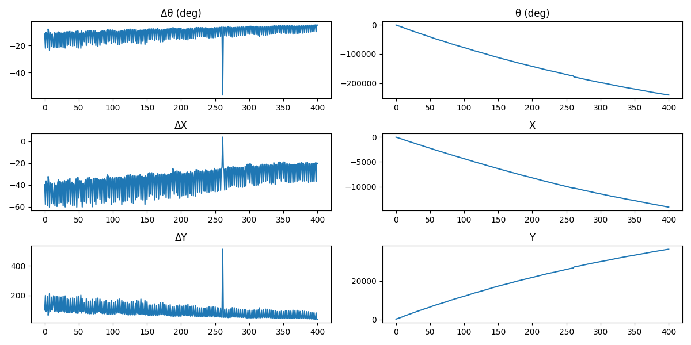
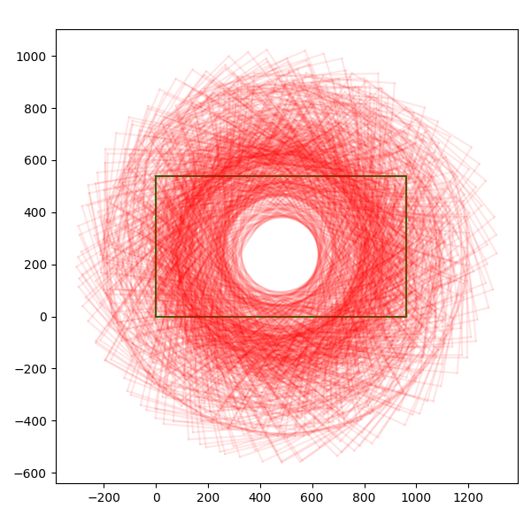
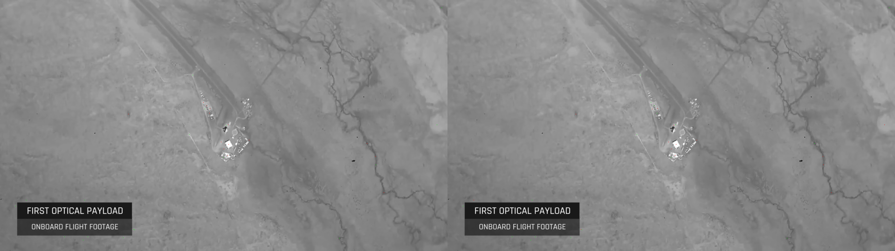

# despin-video

Inspired by the very cool, but very dizzying, video from [SpinLaunch Flight Test #8 – With Camera Onboard](https://www.youtube.com/watch?v=qEVD9k2GLXk), this is a POC of de-spinning videos.

## Brief description

1) Takes a video file and a range of frames.
2) Foreach frame, compute SIFT keypoints+descriptors.
    * discard those that fall inside an optional mask
3) Compute a euclidean transform between frame pairs
    * Method 1: transform between consecutive frames
    * Method 2: transform between the first frame and the current frame
4) Transform each frame with the cumulative transform (if Method 1) and write video

## Requires
* ffmpeg

## Warnings
Frames, features, and transforms are cached but not keyed against parameters like scale for example.

## Usage

```
# whatever virtualenv you like
pip install -r requirements.txt
python despin.py flight-test.mkv  --start-frame 820 --end-frame 1221 --mask flight-mask.png
# output files in /tmp
```

## Output

From the above linked video for frames 820 - 1221

Computed rotation and translation between frames. Accumulated on the right


Original frame drawn in green and global position of subsequent frames in red.


Red pixels are keypoints not matched, green pixels are keypoints matched.


First two frames blended


## Questions/Comments

* Do any of the video editors currently support this?
* Is there a better numerical way to accumulate the transforms to avoid roundoff?

## Future

* A hybrid method which would use the earliest+best match frame to transform against so that there is good stability and drift correction.
